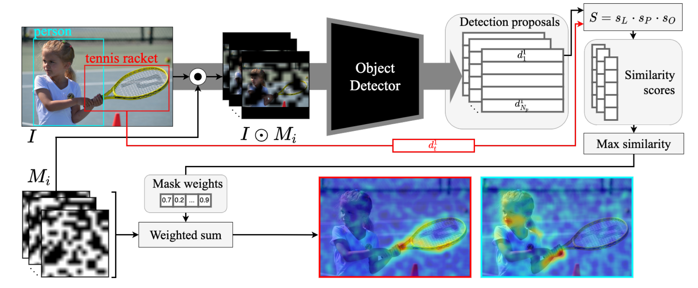

# vision-explanation-methods 

Vision Explanation Methods is an open-source package that implements D-RISE ([Detector Randomized Input Sampling for Explanation](https://arxiv.org/abs/2006.03204)) towards visual interpretations of object detection models.
D-RISE is a black-boxed, or model-agnostic, explainability method which can produce saliency maps for any object detection or instance segmentation models provided these models are appropriately wrapped. In essence, D-RISE works by randomly masking the input images and isolating the parts that are most pertinent for the detection or segmentation of the object in question.  


(Diagram from Petsiuk et al. 2020)


## Example outputs


## Installation

To install the vision explanation package, run:
```
pip install vision-explanation-methods
```

## Colab

The process of fine-tuning an object detection model and visualizing it through D-RISE is illustrated in this [colab notebook](https://colab.research.google.com/drive/1RRJytXf-yBlD_KSOQ0k3TpHItgs56I5q?usp=sharing).

## Basic Usage

To generate saliency maps, import the package and run:
```
res = DRISE_runner.get_drise_saliency_map(
    imagelocation: str,
    model: Optional[object],    
    numclasses: int,
    savename: str,
    nummasks: int=25,
    maskres: Tuple[int, int]=(4,4),
    maskpadding: Optional[int]=None,
    devicechoice: Optional[str]=None,
    wrapperchoice: Optional[object] = PytorchFasterRCNNWrapper
    )
```

## Contributing

This project welcomes contributions and suggestions.  Most contributions require you to agree to a
Contributor License Agreement (CLA) declaring that you have the right to, and actually do, grant us
the rights to use your contribution. For details, visit https://cla.opensource.microsoft.com.

When you submit a pull request, a CLA bot will automatically determine whether you need to provide
a CLA and decorate the PR appropriately (e.g., status check, comment). Simply follow the instructions
provided by the bot. You will only need to do this once across all repos using our CLA.

This project has adopted the [Microsoft Open Source Code of Conduct](https://opensource.microsoft.com/codeofconduct/).
For more information see the [Code of Conduct FAQ](https://opensource.microsoft.com/codeofconduct/faq/) or
contact [opencode@microsoft.com](mailto:opencode@microsoft.com) with any additional questions or comments.

## Trademarks

This project may contain trademarks or logos for projects, products, or services. Authorized use of Microsoft 
trademarks or logos is subject to and must follow 
[Microsoft's Trademark & Brand Guidelines](https://www.microsoft.com/en-us/legal/intellectualproperty/trademarks/usage/general).
Use of Microsoft trademarks or logos in modified versions of this project must not cause confusion or imply Microsoft sponsorship.
Any use of third-party trademarks or logos are subject to those third-party's policies.
